# Facial emotion recognition APP 

Prérequis:
- Installer docker
- Python 3.11.4
- Un IDE: Vscode

NB : Consultez le fichier [DEVELOPER.md](DEVELOPER.md) pour comprendre l'architecture du projet.

Après exécution(ci-dessous), accéder à la page d'acceuil de l'application via [localhost:5000](localhost:5000)  (ou votre ip locale).
La documentation Swagger est accessible via cette adresse également [(localhost:5000)](http://localhost:5000). Nous y avons expliqué l'utilité de chaque endpoint.

Commandes d'exécution :

Pour créer une image docker de l'application api Facial emotion recognition api, dans un terminal, se placer dans le dossier du projet

```
docker build -t facial-emotion-recognition-api:latest .
```

Pour démarrer l'application et les tendems(prometheus/grafana) associés dans un conteneur docker:

```
docker-compose up -d
```
Pour arrêter le tendem prometheus/grafana:

```
docker-compose down -v
```

Pour supprimer tous les images et volumes entre deux compilations, effacer l'option -v

```
docker-compose down
```

Accéder à la page de monitoring Grafana via localhost:3000 (ou votre ip locale).

```
Utiliser identifiant : admin, mot de passe : grafana pour l'authentification.
```
Voici ci-dessous quelques images de l'évolution des métriques scrapées sur grafana.
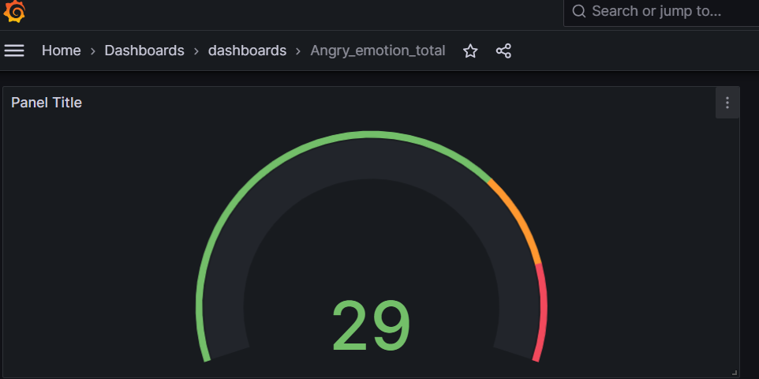
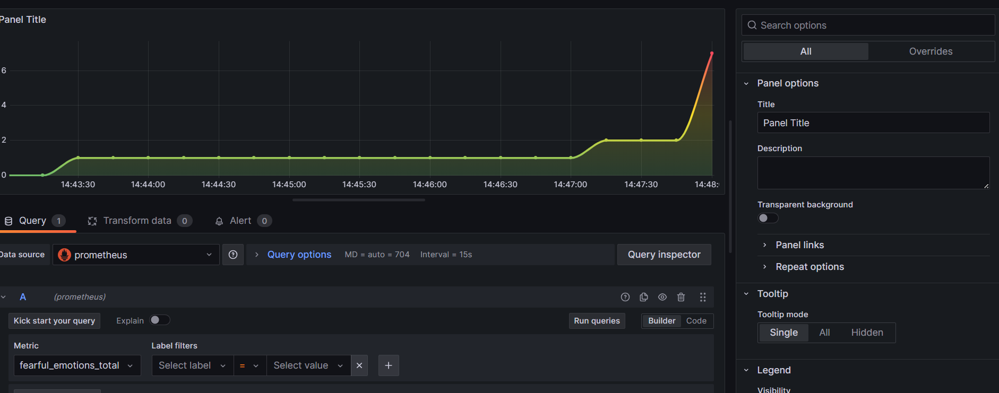

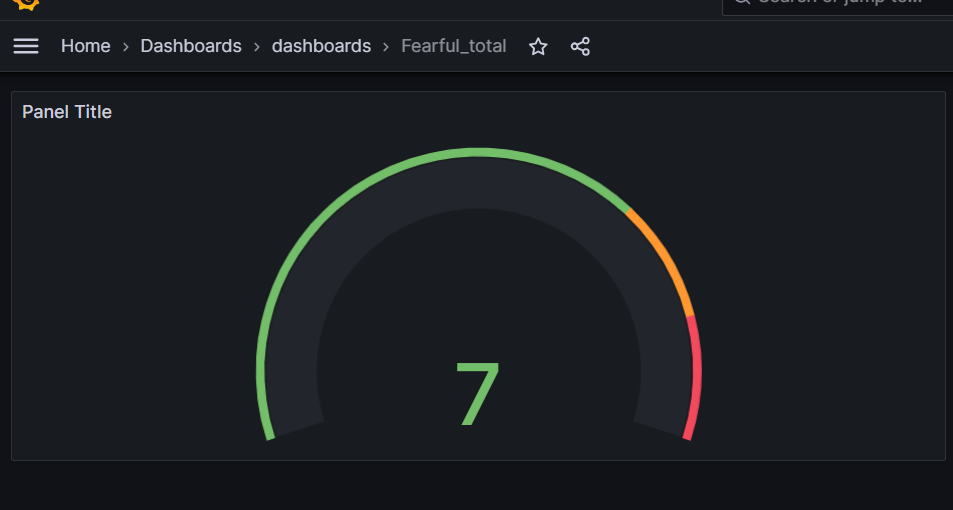

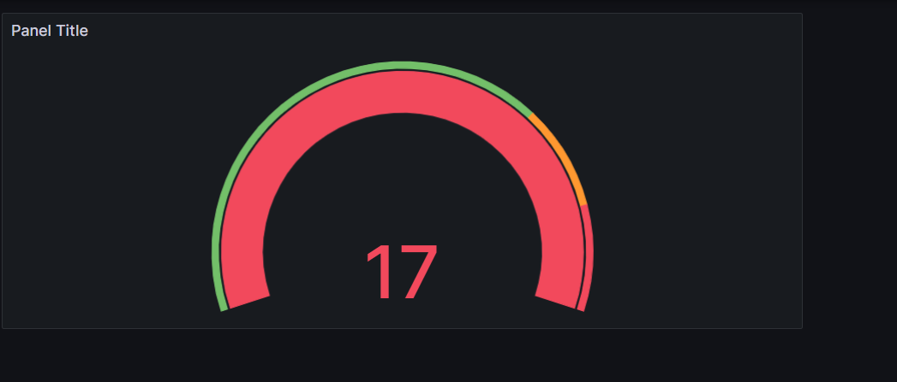
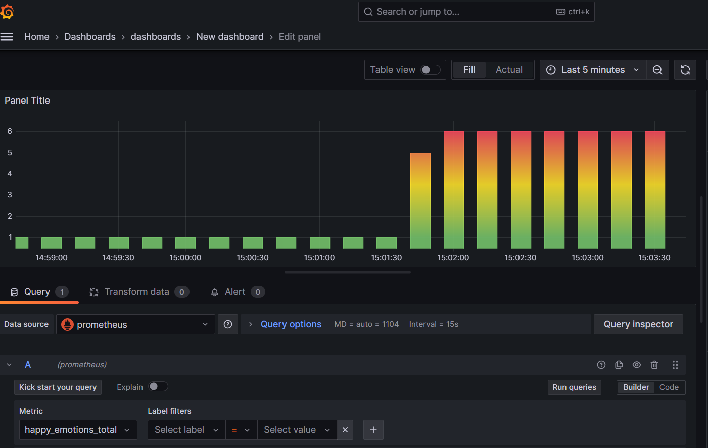
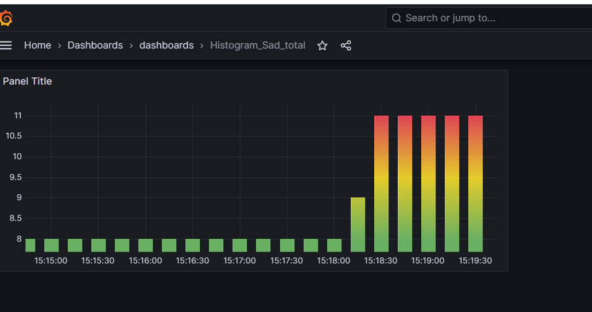
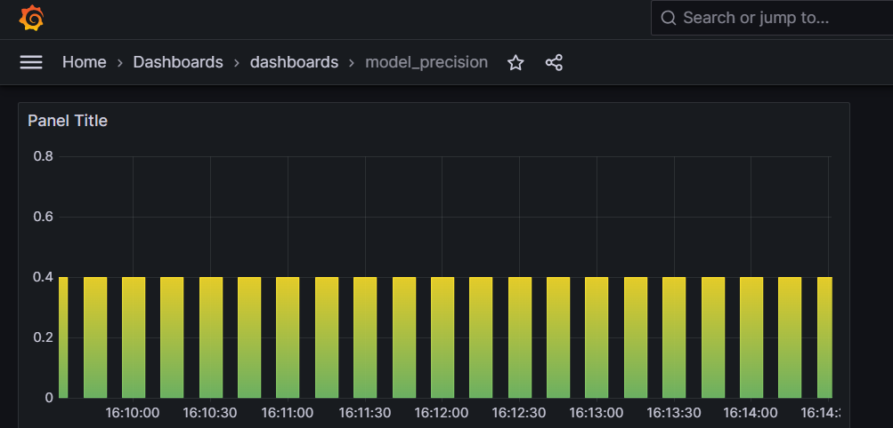
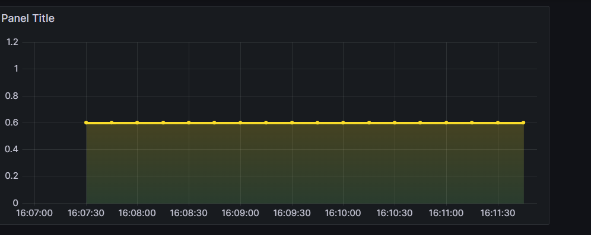
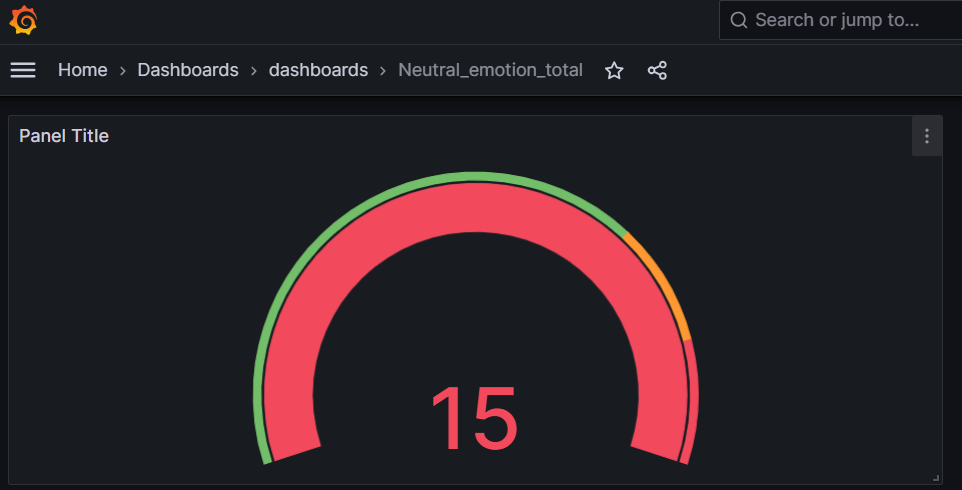
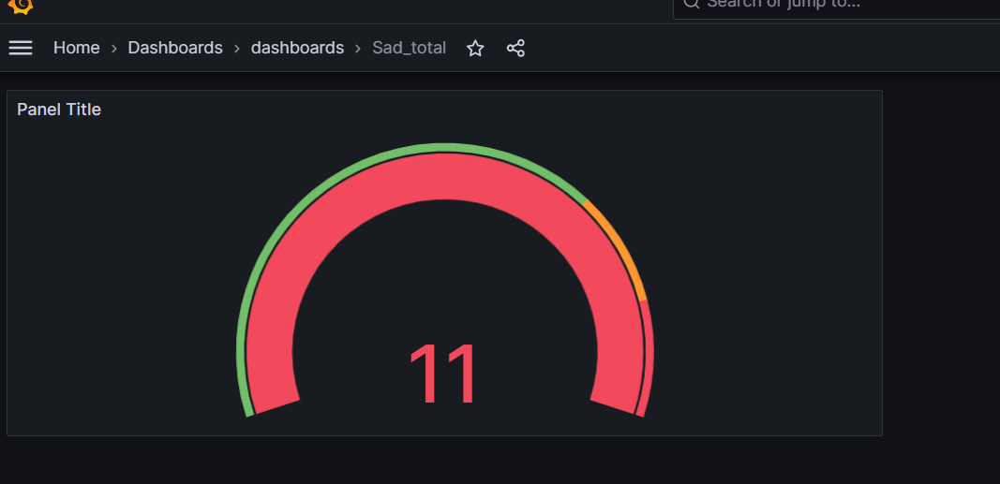
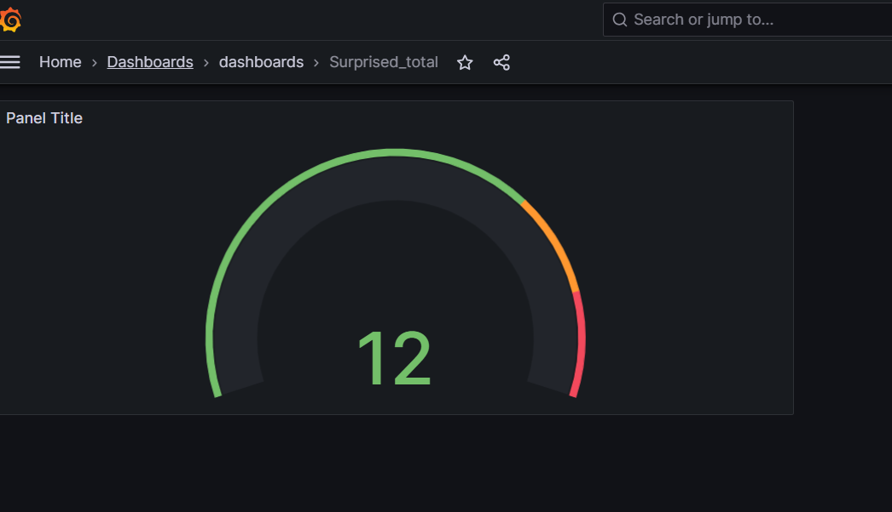

Accéder à la page de monitoring Prometheus via localhost:9090 (ou votre ip locale).
Voici ci-dessous quelques images de la présentation en Graphe sur Prometheus.
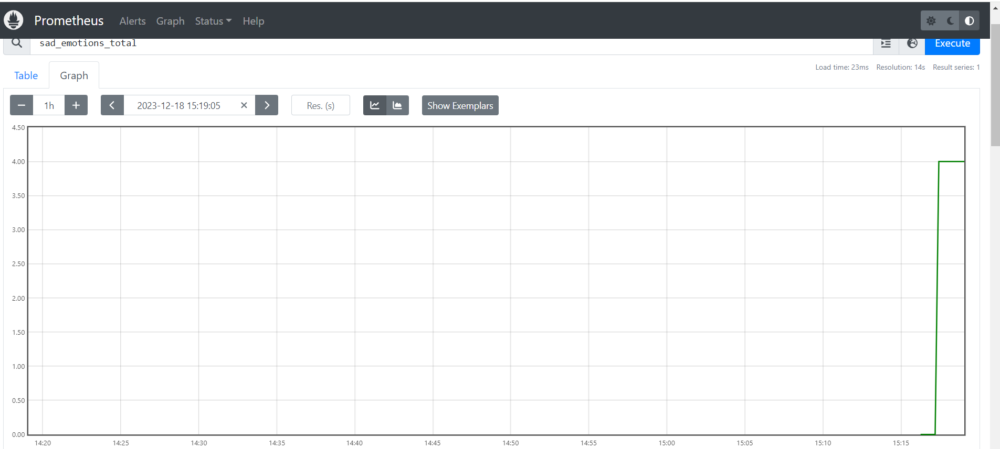
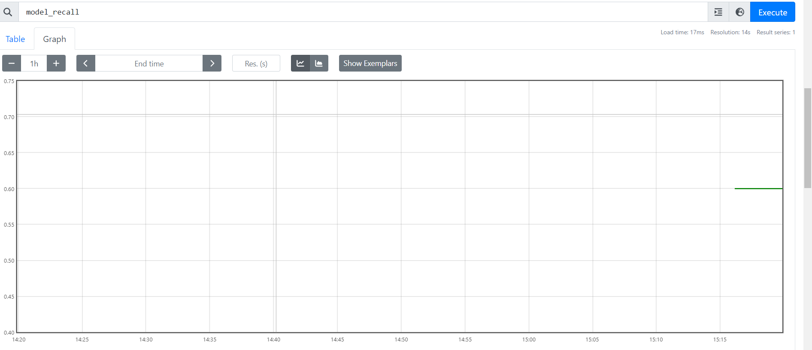
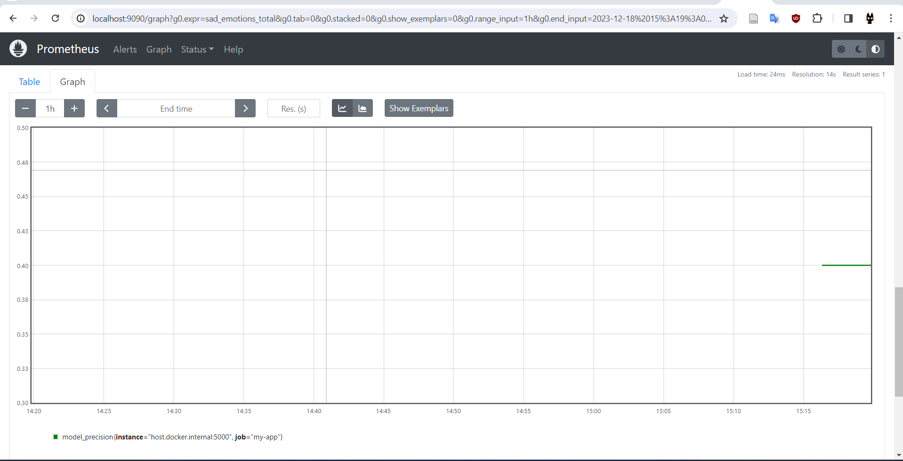
